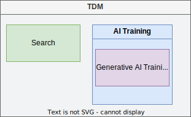

= Opt-Out Vocabulary
Leonard Rosenthol <lrosenth@adobe.com>
1.0, {docdate}: DRAFT
:toc: macro
:outlinelevels: 3 
:appendix-caption: Appendix

ifdef::backend-pdf[]
[.authors]
// {author} + 
{revnumber} {revremark} : {revdate}
endif::[]

// table of contents goes here
toc::[] 

// [abstract]
== Abstract

Transparency of the data used to train AI models is a prerequisite for understanding how these models work. It is crucial for improving accountability in AI development and can strengthen people's ability to exercise their fundamental rights. Yet, opacity in training data is often used to protect AI-developing companies from scrutiny and competition, affecting both copyright holders and anyone else trying to get a better understanding of how these models function.

https://openfuture.eu[Open Future], is committed to advancing openness, transparency, and good governance in AI development. As part of this commitment, they have written a series of white papers on the topic of AI and rights including https://openfuture.eu/wp-content/uploads/2024/05/240516considerations_of_opt-out_compliance_policies.pdf[Considerations FOR opt-out compliance policies by AI model developers].  In that paper, it describes the framework for machine-readable rights reservations required by Article 4(3) of the https://eur-lex.europa.eu/legal-content/EN/TXT/HTML/?uri=CELEX%3A32019L0790[Copyright in the Digital Single Markets (CDSM)] directive statement as: 

> If you tell us what **{identifier}** you want to opt out from which uses **{vocabulary}** via these means **{infrastructure}** then we will do this **{effect of opt-out}**.

This document focuses on the **{vocabulary}** pieces of that statement by describing a proposed Opt-Out Vocabulary that can be used to describe whether one or more assets may be used as part of a data mining or AI/ML training workflow. It is intended to be useful for both location-based as well as unit-based asset identifiers.

// page break
<<<

// start numbering the sections from here...
:sectnums:

== Terms and Definitions

Asset:: A digital file or stream of data containing content and usually with associated metadata. 

Rightsholder:: Person or organization that owns the legal rights to something. See https://en.wiktionary.org/wiki/rightsholder[Wiktionary].

Location-based identifiers:: A machine-readable location, such as a domain or URL, for use in identification of assets. 

Unit-based identifiers:: A machine-readable piece of information that identifies a single asset (unit), regardless of where the asset is located, either through the embedding of that information directly into the asset or via a separate database or registry.

== Use Cases

== Proposed Vocabulary

=== Categories

The following categories are proposed for use in the Opt-Out Vocabulary, based on the set of use cases identified in the previous section:

TDM:: Text and Data Mining. The Copyright in the Digital Single Market (CDSM) Directive defines TDM as "any automated analytical technique aimed at analysing text and data in digital form in order to generate information which includes but is not limited to patterns, trends and correlations" (Article 2.2).

Search and Discovery:: The act of indexing the content (and/or metadata) of assets for the purpose of retrieval.

AI Training:: The act of training an AI/ML (Artificial Intelligence/Machine Learning) model using one or more assets as input. This can include training for classification, object detection, as well as generative AI.

Generative AI Training:: A form of `AI Training` where the AI/ML model being trained can generate new assets based on the training data.

In addition to the pre-defined categories, it is also expected that some systems may extend this list with additional categories for their particular needs.

=== Relationship

The `TDM` category is the overarching category that includes all of the others. This is because activities, reflected in these categories, are considered to be forms of TDM.  As such, if a rightsholder opts out of TDM, they are opting out of all of the other categories as well.

The `AI Training` category includes `Generative AI Training` as well as other forms of AI training. This is because all generative AI training is a form of AI training, but not all AI training is generative.

<<categories-diagram, The figure below>> shows the relationship between the categories.

[[categories.diagram]]
.Relationship between the categories
