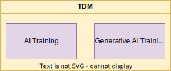

= Opt-Out Vocabulary
Leonard Rosenthol <lrosenth@adobe.com>
1.0, {docdate}: DRAFT
:toc: macro
:outlinelevels: 3 
:appendix-caption: Appendix

ifdef::backend-pdf[]
[.authors]
// {author} + 
{revnumber} {revremark} : {revdate}
endif::[]

// table of contents goes here
toc::[] 

// [abstract]
== Abstract

This document describes a proposed Opt-Out Vocabulary that can be used by various methods - be they location-based or unit-based - to describe whether one or more assets may be used as part of a data mining or AI/ML training workflow.

// page break
<<<

// start numbering the sections from here...
:sectnums:

== Terms and Definitions

Rightsholder:: Person or organization that owns the legal rights to something. See https://en.wiktionary.org/wiki/rightsholder[Wiktionary].

== Use Cases

== Proposed Vocabulary

=== Categories

The following categories are proposed for use in the Opt-Out Vocabulary, based on the set of use cases identified in the previous section:

TDM:: Text and Data Mining. The https://eur-lex.europa.eu/legal-content/EN/TXT/HTML/?uri=CELEX:32019L0790&from=EN[Copyright in the Digital Single Market (CDSM) Directive] defines TDM as "any automated analytical technique aiming to analyse text and data in digital form to generate information such as patterns, trends and correlations" (Article 2.2).

Search:: The act of indexing the content (and/or metadata) of assets for the purpose of retrieval.

AI Training:: The act of training an AI/ML (Artificial Intelligence/Machine Learning) model using one or more assets as input. This can include training for classification, object detection, as well as generative AI.

Generative AI Training:: A form of `AI Training` where the AI/ML model being trained can generate new assets based on the training data.

In addition to the pre-defined categories, it is also expected that some systems may extend this list with additional categories for their particular needs.

=== Relationship

The `TDM` category is the overarching category that includes all of the others. This is because all of those other activities are considered to be forms of TDM.  As such, if a rightsholder opts out of TDM, they are opting out of all of the other categories as well.

The `AI Training` category includes `Generative AI Training` as well as other forms of AI training. This is because all generative AI training is a form of AI training, but not all AI training is generative.

<<categories-diagram, The figure below>> shows the relationship between the categories.

[[categories.diagram]]
.Relationship between the categories
